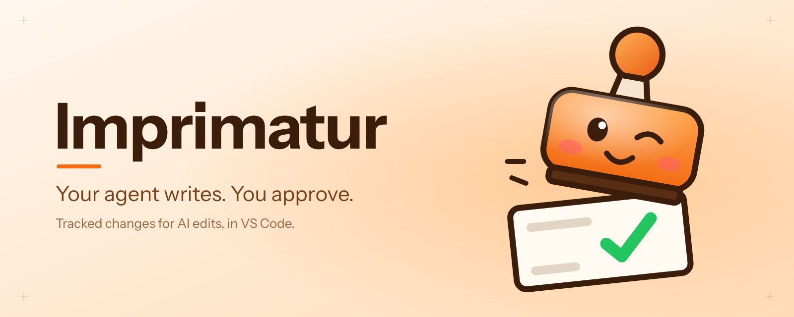
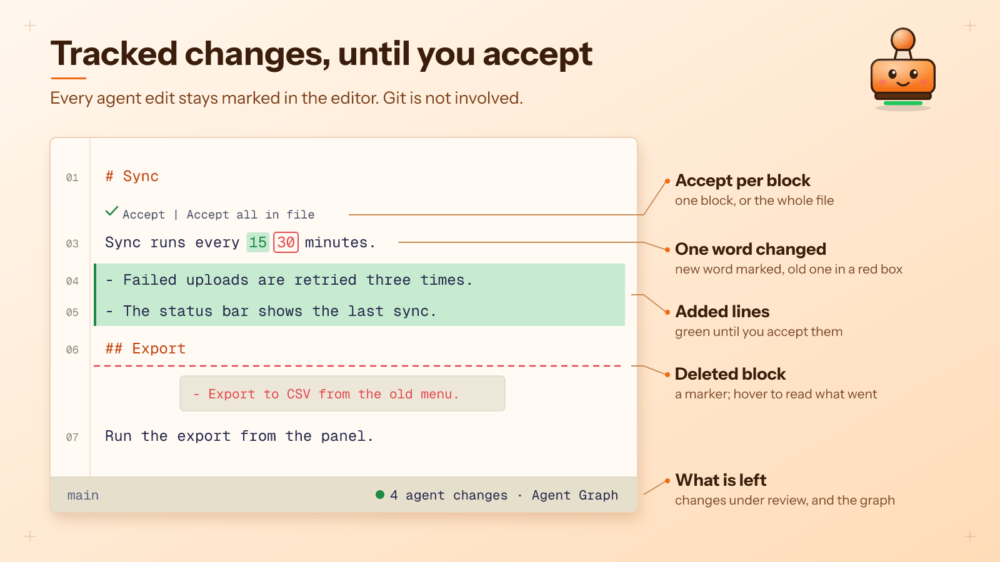
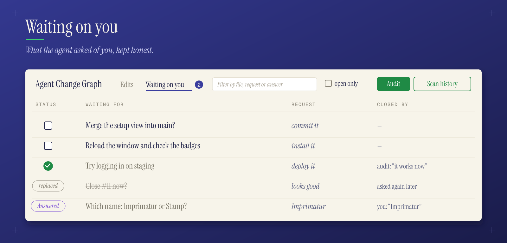
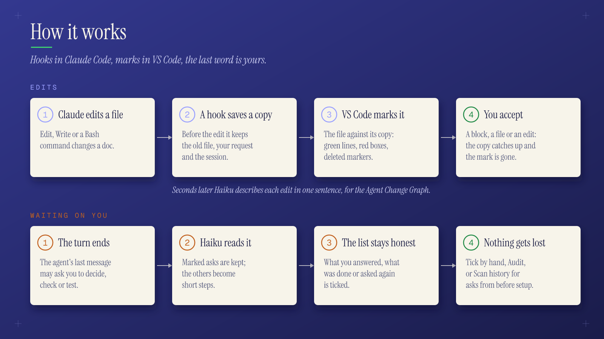

# Imprimatur

**See every doc edit your AI agent makes as tracked changes, until you accept it.**

Your agent rewrote the spec. What changed, and what is it still waiting on you
for? Imprimatur, a VS Code extension with Claude Code hooks, marks the agent's
edits right in your editor and keeps a list of what it asked you.
*Imprimatur* (Latin, "let it be printed") is the approval stamp.



## See exactly what your agent changed

- Added lines in green, a changed word next to the old one in a red box, a
  marker where a block was deleted; in the editor and the Markdown preview.
- **✓ Accept** a block, a file or a whole agent edit, and the mark is gone.
  The view moves to the next change, like a review queue.
- Git is not involved: staging or committing does not clear the marks.
- The **Agent Change Graph** lists every agent edit in the repo, one lane per
  Claude session, each with a one-sentence description of what it changed.

## Never miss what it asked you



- **Waiting on you** collects the agent's questions, permission requests and
  "test this" steps, across sessions, each written to make sense on its own
  ("LATD-13937: send Tim the follow-up mail about the !2690 review"), with a
  line on why.
- A step shows its task: click the key to open its issue or Jira page (the link
  in the task's TODO.md, or the repo's GitHub issue), or the 📄 to open the
  TODO.md at the line that says it.
- After each turn Haiku keeps the list honest: what you answered, what was done
  or asked again is ticked. **Audit** reviews it on demand.
- Set up after work began? **Scan history** reads your past Claude sessions and
  `TODO.md` files for asks you may have missed.

## Quick start

1. Clone this repo; you need Node 22+, git, VS Code 1.100+ and the `claude` CLI.
2. Run `npm run setup` in it: it adds the Claude Code hooks for every repo and
   installs the extension.
3. Ask Claude to edit a Markdown file, then open it: the changes are marked.
   Click **Agent Graph** in the status bar for the edits and what waits on you.

## Reference

### Features

- Added lines get a green background.
- A changed line where only one word changed marks that word: the new word
  highlighted, the old one in a red box next to it. When more than one word
  changed, the old sentence is shown above the line (a CodeLens: the editor API
  cannot insert a real line) and the new line is highlighted.
- A deleted block shows a red marker on the line before it; hover to read it.
- Marks in the overview ruler, a change count in the status bar.
- **✓ Accept** in the editor (CodeLens) per Markdown unit: a block that is all
  new (table, quote, list item, paragraph, heading, code, HTML, rule) is one
  unit, a changed line (e.g. a table cell) is its own; and on each
  changed block in the Markdown preview accepts that block; **Imprimatur:
  Accept Agent Change at Cursor** and **Accept All Agent Changes in File** do
  the same from the command palette. After an accept the view moves to the
  next change, like a review queue.
- Old text is shown as plain text in a red box (no strike line, so it stays
  readable); in the preview it is rendered as Markdown.
- **Imprimatur: Show Agent Edit History** (command palette) lists the
  agent's edits to the file newest first, like a commit log; pick one to open
  its diff (before / after), or **All changes under review**.
- **Agent Change Graph** (status bar **Agent Graph**, or the command palette): every agent
  edit in the repo as a table like Git Graph, one colored lane per Claude
  session, click a row for its diff. The description is one plain sentence on
  what the edit changed, written a few seconds later by a small model from the
  edit's diff ([hooks/describe.mjs](hooks/describe.mjs), `claude -p --model
  haiku`, run in the background; language from `IMPRIMATUR_LANG`, default
  English; `IMPRIMATUR_DESCRIBE=off` turns it off). Until then, or without it:
  what the agent said it was doing, else the nearest heading and the first
  changed line. Hover the description for all of it. Your request is in the row's tooltip, the
  session column shows Claude's title for the conversation.
  A green ✓ marks edits with nothing left under review, an amber dot the rest:
  hover it for an Accept button (or right-click the row: Accept this edit, Go to change, Open
  diff); hover the status cell to see its change (the popup stays while you move into
  it, and scrolls). A Markdown edit shows rendered, as the preview's review: its added
  and changed blocks marked, old text in red boxes, one block of context around each. The status bar's **Agent Graph** button opens it and shows
  how many asks wait on you.
- **Imprimatur side bar** (its own icon in the activity bar): a row that opens
  the Agent Change Graph (with edits under review and asks waiting on you),
  then **Agent setup**: every file in the repo, and in your home folder, that
  shapes a coding agent, whatever the tool: Claude Code (CLAUDE.md, settings
  hooks and permissions, hook scripts, skills, commands, agents, MCP), Cursor
  rules, Copilot instructions, AGENTS.md, GEMINI.md, Windsurf, Cline, Aider,
  and the git hooks commits run through. Grouped by tool, each with a one-line
  summary (a settings file lists its hooks); files new, changed or removed
  since you last looked are marked until you Mark all as seen. Read only.
- **Waiting on you**, the graph's second tab: everything the agent asked of
  you (questions, commands waiting for permission, "verify / test this" at the
  end of a turn), open ones first. Questions close once you reply; things to go
  and do ("test this", "Reload Window") stay open until you Mark as done or
  tick every step, your later replies kept on them as notes. The tab is a flat
  list like the edits: one row per step, newest first, history kept. A row's
  status is a checkbox while open (tick it when done), then ✓ done (by you, a
  chat reply or the audit), "replaced" (asked again later), or Answered;
  "open only" hides the rest. Click a row for the full message; right-click:
  Mark as done, Copy. The Graph column shows
  only with more than one session. The filter works on both tabs.

Setting `imprimatur.showIn`: Markdown files are marked only in the preview by
default (`preview`); `both` adds the editor marks and its ✓ Accept lenses,
`editor` uses the editor only. Other file types are always marked in the editor.
`imprimatur.editorAlsoFor` (globs, e.g. `["**/todos/**"]`) adds the editor
marks for matching Markdown files while `showIn` stays `preview`.

The Markdown preview also gets thin marks over its scrollbar, like the editor's
overview ruler: one colored tick
per change (green added, blue changed, red old or deleted),
click a tick to jump there.

With `imprimatur.mermaidDiff` on (off by default; two Mermaid preview
extensions in one window can then fail to render), changed Mermaid flowcharts
are colored in the preview like a visual diff: new
nodes and arrows green, changed labels orange, removed ones red and dashed
(kept visible), with a legend and an Accept button above the diagram.

The Markdown preview shows the same changes per block: changed blocks are
colored, their old text struck through right above them, deleted lines struck
through where they were.

**Archive.** Once a day per repo, what is older than `imprimatur.archive.afterDays`
(7 by default, `0` = never) leaves the graph and the waiting list: an older
agent edit counts as accepted, its history row moves to
`.claude/imprimatur/archive/<date>/` (gzipped, same layout, read with `zcat`),
and so do waiting logs with nothing open. Open asks stay until you do them.
**Imprimatur: Archive Old Agent Edits and Asks Now** runs it at once.

### How it works



1. A Claude Code hook ([hooks/baseline.mjs](hooks/baseline.mjs)), before each
   agent edit of a listed file type (Edit, Write, or a Bash command that names
   the file, e.g. a python or sed edit; Bash is compared before/after so read-only
   commands leave no trace):
   - copies the file to `.claude/imprimatur/baseline/<path>` if there is no
     copy yet (an empty copy for a new file);
   - appends `{t, session, tool, prompt, before}` to
     `.claude/imprimatur/history/<path>.jsonl`, a history of the agent's edits.
2. The VS Code extension ([vscode/](vscode/)) diffs each open file against its
   copy (line LCS, then word LCS inside changed lines). Every change looks the
   same, whichever agent edit made it; the edit history keeps the order.
3. Accept writes the change at the cursor into the copy; Accept all deletes the
   copy. The history stays.
4. A second hook ([hooks/waiting.mjs](hooks/waiting.mjs)) appends what the
   agent waits on you for to `.claude/imprimatur/waiting/<session>.jsonl`:
   AskUserQuestion, PermissionRequest, input notifications, and the lines of
   the final message that ask something (a `?`, phrases like "test et",
   "please verify", "shall I", or any line starting with 👉). A later event in
   the session closes earlier questions, your next prompt kept as the answer;
   things to go and do stay open until you mark them done. After each of your
   messages, [hooks/resolve.mjs](hooks/resolve.mjs) asks a small model which
   open steps the message settled ("tamam birleştir" settles "shall I merge?")
   and ticks them, tagged "chat"; the agent's next message does the same for
   steps it reports done or asks again. A message that names a task
   (`LATD-13977`, or `13977` alone) also settles that task's steps asked in
   other sessions. An item closes when all its steps are ticked. When a task's
   `docs/todos/<task>/TODO.md` (or the older `todos/<task>/TODO.md`) says done (its `## Durum` / `## Status` starts with
   Bitti or Done), the next turn end ticks the task's steps in every session,
   except ones asked after the TODO.md last changed. After each agent turn, Haiku audits the list with the agent's final
   message ([vscode/audit.js](vscode/audit.js)): it closes steps that are done,
   answered or only reports, and writes what the message really asks as short
   steps (the agent's 👉 lines verbatim, when it marks its asks; an ask in
   nearly the same words replaces the old step). The **Audit** button in the
   tab runs the same review on demand. Without the model, the rules above.

5. **Scan history** ([vscode/history.js](vscode/history.js)) finds what was
   already waiting on you when Imprimatur was set up after work began. It runs
   once when the panel first opens in a project, and again from the button.
   It reads Claude Code's own transcripts of the project
   (`~/.claude/projects/<project>/*.jsonl`, last 30 days): earlier turns' 👉
   lines become steps, your later messages are kept on them, and Haiku audits
   each session with its final message, as the hook would have. Sessions that
   already have a log or were scanned before are skipped (`.claude/imprimatur/scanned.json`).
   It also adds the `TODO: (K)` lines (your own to-dos) of `TODO.md` and
   `docs/todos/*/TODO.md` (or `todos/*/TODO.md`); on the next scan the ones marked DONE or removed are ticked.

### Setup options, or install by hand

`npm run setup` options: `--lang Turkish` (language of the model's
descriptions and steps; default English), `--dry-run` shows the changes only,
`--no-extension` skips the extension, `--show-in both` also marks Markdown in
the editor (VS Code machine settings, `imprimatur.showIn`). It backs up
`~/.claude/settings.json`, adds the hooks below for every repo (updates ours in
place, leaves others alone), packages and installs the extension, and checks
for the `claude` CLI. Or by hand:

1. Hook, in your project's `.claude/settings.json` (extensions after the
   script name; default `md mdx`):

   ```json
   {
     "hooks": {
       "PreToolUse": [
         {
           "matcher": "Edit|Write|Bash",
           "hooks": [{ "type": "command", "command": "node \"$CLAUDE_PROJECT_DIR\"/path/to/imprimatur/hooks/baseline.mjs md mdx" }]
         }
       ],
       "PostToolUse": [
         {
           "matcher": "Bash",
           "hooks": [{ "type": "command", "command": "node \"$CLAUDE_PROJECT_DIR\"/path/to/imprimatur/hooks/baseline.mjs md mdx" }]
         }
       ],
       "PostToolUseFailure": [
         {
           "matcher": "Bash",
           "hooks": [{ "type": "command", "command": "node \"$CLAUDE_PROJECT_DIR\"/path/to/imprimatur/hooks/baseline.mjs md mdx" }]
         }
       ]
     }
   }
   ```

   `PostToolUseFailure` records a Bash command that edited a file and then
   failed (without it, that edit is lost).

   For the **Waiting on you** tab, also run `hooks/waiting.mjs` (no
   arguments) on `PreToolUse` and `PostToolUse` with matcher `AskUserQuestion`,
   on `PermissionRequest`, `Stop` and `UserPromptSubmit`, and on `Notification`
   with matcher `agent_needs_input|elicitation_dialog|elicitation_url_dialog`.

2. Ignore the copies: add `.claude/imprimatur/` to `.gitignore` (or to your
   global git ignore file).
3. Extension: `npm run package`, then install `dist/imprimatur-<version>.vsix`
   (`code --install-extension …`, or Extensions view → Install from VSIX).

### Limits

- No marks in diff tabs (e.g. Working Tree): git already colors those.
- Bash edits are seen only for files named in the command; a glob
  (`sed -i *.md`) is missed.
- Ordered list numbers are not compared: deleting an item does not mark the
  renumbered items after it.
- Changes inside fenced code blocks (``` or ~~~) are not marked; the edit
  history still lists them.
- The preview works per block (no word marks there); a deleted table row is not
  shown in the preview.
- Every difference between the copy and the file is marked, including your own
  edits to the same file.
- The history stores the full text before each edit: small for documents.
- Plain O(n·m) LCS on the part between the common head and tail; fine for
  documents, slow for files with thousands of changed lines.

### Develop

```sh
npm install      # markdown-it, for the preview tests only
npm test         # hook, diff and preview tests (node:test)
npm run package  # builds dist/imprimatur-<version>.vsix
```

## License

MIT
