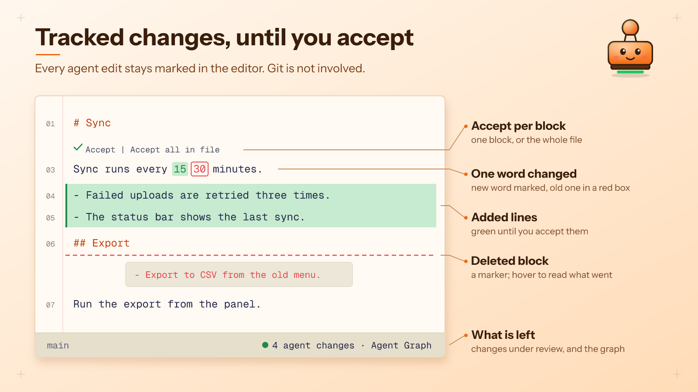
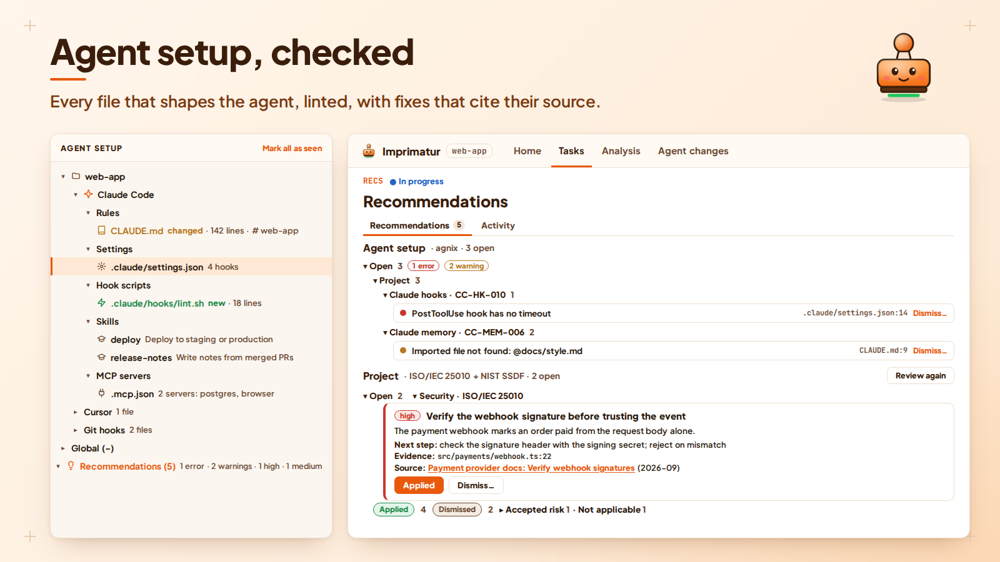
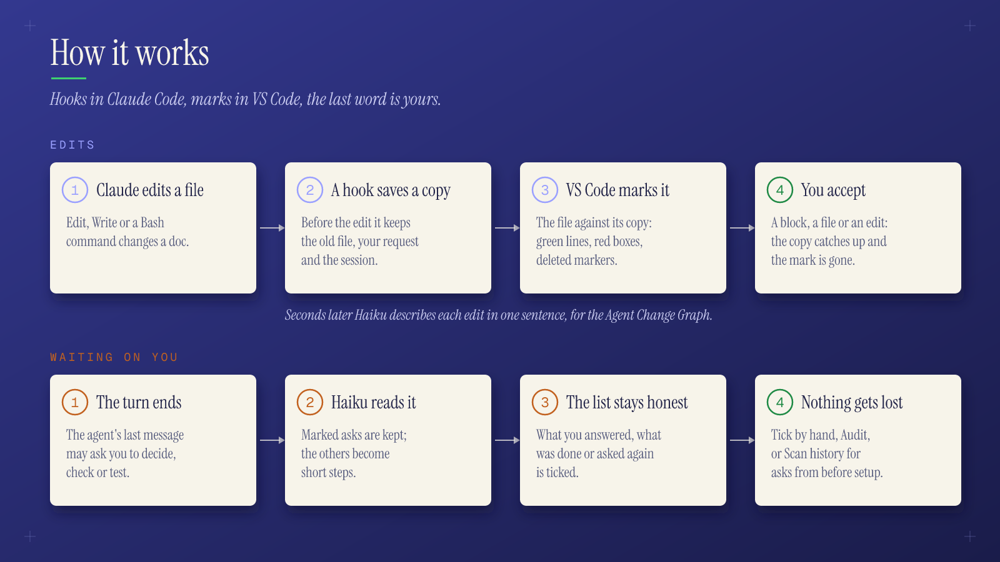

# Imprimatur

[](https://marketplace.visualstudio.com/items?itemName=halilural.imprimatur)
[](https://marketplace.visualstudio.com/items?itemName=halilural.imprimatur)
[](https://open-vsx.org/extension/halilural/imprimatur)
[](https://open-vsx.org/extension/halilural/imprimatur)
[](https://github.com/halilural/imprimatur/actions/workflows/release.yml)
[](LICENSE)

**See every doc edit your AI agent makes as tracked changes, until you accept it.**

Imprimatur is a VS Code extension and a Claude Code plugin (hooks and an MCP server).
*Imprimatur* is Latin for "let it be printed": the approval stamp.

- **Review what the agent wrote.** Its edits stay marked in the editor and the Markdown
  preview until you accept them. Committing does not clear them.
- **Never miss what it asked you.** Questions, permission requests and "test this" steps
  from every session land in one list that keeps itself up to date.
- **Know where you left off.** Tasks, decisions and design documents live in one local
  database that the agent reads and writes through MCP.

## Tracked changes until you accept



Added lines are green. A changed word sits next to the old one in a red box. A deleted
block leaves a marker. **✓ Accept** a block, a file or a whole agent edit, and the view
moves to the next change. The panel's **Edits** page lists the agent's edits still under
review, file by file, each with a one-sentence description, Accept, Diff and Go.

## Waiting on you

The agent's questions, permission requests and "test this" steps, across sessions, each
written to make sense on its own and tied to its task. After each turn a small model
ticks what you answered or what was done. The panel's **Home** shows them as **Needs you**,
beside what is in progress and what finished this week.

## Where you left off: tasks and 👉

Each task keeps its to-dos, questions, decisions, notes, ADRs and tests. The 👉 pointer
marks where work stopped. The agent gets it at session start; you see it on **Home**, on
the task's page and in Claude Code's status line. A task's page shows its spec with its
gates (stories, design, analysis, tickets): only your own approval passes a gate.

## Documents in Matt Pocock's model

Imprimatur carries 19 of [Matt Pocock's skills](https://github.com/mattpocock/skills) and is
their local tracker. Every repo has a small project page (mission, constraints, tech stack,
roadmap), its capabilities (how each feature behaves now), ADRs, a glossary and out-of-scope
notes, kept in sections and written to `docs/PROJECT.md`, `docs/capabilities/`,
`docs/adr/`, `GLOSSARY.md` and `.out-of-scope/`. A task's spec is written with `/to-spec`
and split with `/to-tickets`. The panel's **Docs** page reads them all in one layout, and
**Search and Ask** (`ctrl/cmd+alt+k`) finds a record or section, or answers with citations.

## /study

`/study #92` writes a study note on a task, then quizzes you and keeps a mastery score, so
the next study asks the weak questions first.

## /exercise: practise anything in small steps

`/exercise <topic>` turns any topic (code, a concept, a spoken language, a sport) into an
exercise: a few questions about why and your level, a "can do" goal, and 5 to 9 short steps
that each say what they are for and when they count as done. You tick them in the
panel's **Exercises** page, and the agent coaches without giving the answers away.

## /social-post: posts that follow each platform's current rules

`/social-post` reads the platform's own rules before it writes (a subreddit's sidebar, X's
character counting, the Show HN guidelines), fits the post to them and checks it. Turn on
**social media tracking** for a repo (off by default) and the posts, the rules read and how
each one did are kept on a **Social** page in the panel.

## Agent setup audit and recommendations



**Agent setup** shows every file that shapes a coding agent, in the repo and your home
folder: Claude Code, Cursor, Copilot, AGENTS.md, Gemini, Windsurf, Cline, Aider.
**Recommendations** lints them with [agnix](https://github.com/agent-sh/agnix) and, on
request, reviews the project against current best practice. Each finding stays as a
record: open, applied or dismissed.

## More

- **Issue tracker sync**: task status follows GitHub Issues or Jira, both ways.
- **Process checks** (opt-in per repo): block `--no-verify`, keep code off `main`, warn
  when code starts before its ADR.
- **Unread marks**: edits and document sections the agent changed that you have not read.
- **Edit history**: the agent's edits to a file, newest first, each with its diff.
- **Mermaid diff** (off by default): changed flowcharts colored in the preview.
- **Archive**: edits and asks older than 7 days leave review on their own.
- **Plugins**: optional local plugins hear every change and can add commands.
- **Other agents**: Cursor and Codex get the same MCP tools.

## Install

Imprimatur has two parts. Install both.

**1. The Claude Code plugin** (hooks and the MCP server):

```sh
claude plugin marketplace add halilural/imprimatur
claude plugin install imprimatur@imprimatur
```

**2. The VS Code extension**, from the Visual Studio Marketplace or Open VSX:

```text
ext install halilural.imprimatur
```

Or install a `.vsix` from the [GitHub releases](https://github.com/halilural/imprimatur/releases)
(Extensions view → Install from VSIX).

To install from a clone instead, with the status line, see
[Setup options](docs/REFERENCE.md#setup-options).

### Auto mode

In auto mode, every MCP call without an allow rule waits for Claude Code's permission
check. In one day's log that check took 5.5 s per Imprimatur call on average, while the
call itself took 5 to 108 ms. Allow the server in `~/.claude/settings.json`:

```json
{ "permissions": { "allow": ["mcp__plugin_imprimatur_imprimatur"] } }
```

Use `"mcp__imprimatur"` instead when you installed from a clone without the plugin.
`npm run setup` adds the matching rule for you (`--no-allow` skips it), and the setup
audit warns when the rule is missing (`IMP-MCP-001`).

### Fewer MCP tools

Claude Code loads MCP tools by name and fetches a tool's definition only when it is about to
call it. Clients that load every definition up front (Cursor, Codex) pay for the whole list.
To make the list shorter, pick a profile:

| Profile | Tools | What the model reads |
| --- | --- | --- |
| `core` | 7: where_we_left_off, task_get, task_upsert, record_add, record_update, search, pointer_set | ~1.7k tokens |
| `standard` | 10: core plus task_list, doc_get, doc_section_upsert | ~2.7k tokens |
| `all` (default) | 15: also study_material, the exercise tools, setup_audit | ~4.6k tokens |

Set it in `IMPRIMATUR_TOOLS`, in `"mcp": {"tools": "core"}` of the repo's
`.claude/imprimatur.json`, or in the same key of `config.json` in the database folder (first
found wins). Profiles, groups (`list`, `docs`, `study`, `exercise`, `audit`) and tool names
combine: `core,exercise` keeps `/exercise` working. `/study` needs `study`, and `/exercise`
needs `exercise`.

### Requirements

- Node.js 22.13 or later, and the `claude` CLI on your `PATH` (the model features use it).
- VS Code 1.100 or later.
- Linux, macOS or WSL. On WSL, keep the database on the Linux side, not under
  `/mnt/<drive>`: Imprimatur refuses a database there.

## Quick start

1. Install both parts, then reload VS Code.
2. Ask Claude to edit a Markdown file in a repo.
3. Open the file's preview: the changes are marked. Click **✓ Accept** on a block.
4. Click Imprimatur's button in the status bar for the edits under review.
5. Open the Imprimatur icon in the activity bar, then **Home**: the panel has **Home**,
   **Tasks**, **Docs**, **Edits** and **Setup** (`g` then a letter jumps between them).
6. Markdown is marked in the preview only; set `imprimatur.showIn` to `both` for
   editor marks too.

## How it works



1. Before each agent edit of a Markdown file, a hook copies the file to
   `.claude/imprimatur/baseline/` and logs the edit.
2. The extension diffs each open file against its copy. Accept writes the change into
   the copy. Git is not involved.
3. Other hooks record what the agent waits on you for, and at the end of a turn a small
   model keeps that list honest.
4. Tasks and records live in one SQLite database per machine. The agent uses them
   through the MCP server; you use the panel.

Details: [Reference](docs/REFERENCE.md#how-it-works).

## Privacy and cost

- Everything is stored on your machine: the copies in `.claude/imprimatur/` in each repo
  (add it to `.gitignore`) and the database in your data folder.
- Model calls run through your own `claude` CLI and count against your Claude plan.
  Most use Haiku, and only where a rule is not enough: an edit's one-sentence description,
  closing answered asks and the end-of-turn audit. Search and Ask's answers use Sonnet.
- The best-practice review runs only when you ask, after a confirmation.
- Nothing else leaves your machine, except the issue tracker sync (GitHub with `gh`
  logged in, or Jira once you configure it), agnix fetched with `npx` for the audit, and
  the documentation the best-practice review fetches.
- `IMPRIMATUR_DESCRIBE=off` turns off edit descriptions. In an untrusted folder no model
  call, `gh` or repo script runs.

## Links

- [Reference](docs/REFERENCE.md): every feature, setup option, hook, MCP tool and setting.
- This repo's documents: [Project](docs/PROJECT.md), [Capabilities](docs/capabilities/),
  [ADRs](docs/adr/), [Glossary](GLOSSARY.md).
- [Changelog](vscode/CHANGELOG.md)
- [Contributing](CONTRIBUTING.md)
- [Security](SECURITY.md): report vulnerabilities privately.

## License

[MIT](LICENSE) © 2026 Halil Ural
