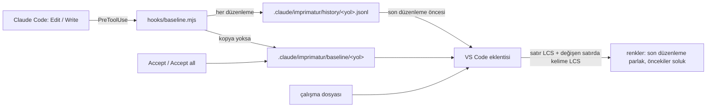

# Imprimatur — mimari

## Modül

Ajanın değiştirdiği dosyalar, kullanıcı kabul edene kadar editörde Word'ün
izlenen değişiklikleri gibi renkli görünür; git'e (stage, commit) bağlı
değildir, commit'ten sonra da durur. Bağımsız modül
([#3](https://github.com/halilural/imprimatur/issues/3),
[#5](https://github.com/halilural/imprimatur/issues/5), epic
[#2](https://github.com/halilural/imprimatur/issues/2)); 2026-10-03'ten beri ayrı public repoda:
[halilural/imprimatur](https://github.com/halilural/imprimatur) (kendi issue'ları ve panosu); aşağıdaki yollar o reponun köküne göredir. Bu makinede global kurulu
([#4](https://github.com/halilural/imprimatur/issues/4)).



- ARCH: `hooks/baseline.mjs` — PreToolUse `Edit|Write` (Claude Code'da `MultiEdit` yok). Uzantısı listede olan dosyaya (varsayılan `md`, `mdx`) dokunulmadan önce: kopya yoksa dosyanın git kökünde (git yoksa proje kökünde) `.claude/imprimatur/baseline/<yol>` altına yazar (dosya yoksa boş); kopya varsa dokunmaz. Her düzenlemede `.claude/imprimatur/history/<yol>.jsonl`'a bir satır ekler: `{t, session, tool, before}` (düzenleme öncesi metin). Git'e bakmaz. Bash da (0.9.0): PreToolUse'da komut metninde adı geçen .md/.mdx dosyalarının içeriği `.claude/imprimatur/pending/<tool_use_id>.json`'a, PostToolUse'da içerik değiştiyse Edit gibi kopya + tarihçe (`tool: "Bash"`), değişmediyse iz yok; glob ile ulaşılan dosya yakalanmaz. Her durumda exit 0. (#3, #5)
- ARCH: `vscode/` — VS Code eklentisi, bağımlılıksız JS. Kopyası olan her dosyayı kopyayla karşılaştırır (ortak baş/son kırpılır, satır LCS; eşleşen silme+ekleme çiftleri "değişen satır", içlerinde kelime LCS). Satırda yalnız tek kelime değiştiyse kelime işareti; birden çok kelime değiştiyse cümle düzeyi: eski cümle satırın başında (girintiden sonra) kırmızı üstü çizili, yeni cümle hemen ardından vurgulu (dekorasyon araya gerçek satır ekleyemez). Eklenen satır yeşil, silinen blok önceki satırın sonunda kırmızı işaret (tamamı hover'da). Overview ruler işaretleri, durum çubuğunda "N agent changes (M latest)". (#3, #5)
- ARCH: Blok blok Accept (0.7.0, #5) — editörde CodeLens "✓ Accept" Markdown birimi başına (0.15.0, `acceptGroups`): blok sınırları VS Code'un markdown-it'inden (önizleme eklentisinin örneği `extendMarkdownIt`'te alınır, açılışta `markdown.api.render` ile yüklenir; yoksa satır sezgisi); tamamı yeni olan blok tek birim (CommonMark: başlık, paragraf, kod, HTML bloğu, ayraç, blok alıntı, liste maddesi; GFM: tablo); aynı (en küçük) bloğun içinde art arda eklenen satırlar da tek birim (var olan tabloya eklenen satırlar, paragrafa ya da alıntıya eklenen satırlar; 0.15.1), liste maddeleri ayrı, değişen satır (ör. tablo hücresi) tek satır, silme önceki satırla (önceden diff parçası başınaydı, boş satırsız 10 madde tek parça olunca hepsi birden gidiyordu); önizlemede tablonun üstünde tek "✓ Accept table" (tablo içine düğme konamaz); önizlemede her değişen bloğun üstünde "✓ Accept" bağlantısı. Önizleme `command:` bağlantılarını çalıştırmaz, yalnız `http/https/mailto/vscode` geçer (markdown-language-features preview-src/index.ts): bağlantı `vscode://halilural.imprimatur/accept?file&start&end`, eklenti `window.registerUriHandler` ile yakalar. Adres işletim sisteminden geçip başka bir VS Code penceresine düşebilir: kök, çalışma alanında değilse dosyanın kendi git kökünden bulunur (klasör başına önbellek); her adres ve sonucu "Imprimatur" çıktı kanalına yazılır (0.11.0). İkisi de `acceptRange(dosya, başlangıç, bitiş)` → `acceptLines` (0.10.5): yalnız o satırlar (ve hemen bitişik boş satırlar) kopyaya yazılır; bir diff parçası birden çok bloğa yayılabildiği için (ajanın eklediği maddenin EN ve TR paragrafı) parça bütün olarak kabul edilmez, döngü yok. Eski metin okunur (0.9.1): üstü çizgisiz, normal yazı, kırmızı kutu içinde (kenar + bant); önizlemede Markdown olarak (liste/başlık işareti atılır). (#5)
- ARCH: Önizleme işaret şeridi (0.10.0, #5) — `markdown.previewScripts` ile önizlemeye `preview-markers.js`: sağ kenarda, kaydırma çubuğunun üstünde editör overview ruler'ı gibi ince çentikler (0.10.3; şerit tıklama almaz, yalnız çentikler), her `imprimatur-added/changed/old` bloğu için konumu ve boyu belge yüksekliğine oranlı renkli çentik (yeşil/mavi/kırmızı, önceki düzenleme soluk); tıklayınca `scrollIntoView`; aynı betik kaydırma konumunu `sessionStorage`'a yazar ve son 5 sn içinde yeniden yüklenirse (Accept ya da ajan düzenlemesi sonrası `markdown.preview.refresh`) o konuma döner, ilk açılışta önizlemenin kendi editör senkronuna dokunmaz (0.10.1); ✓ Accept'e tıklanınca bloğun yeri yazılır, yenilemeden sonra o yerin altındaki ilk işaretli bloğa kayılır (0.10.2); editörde CodeLens ile kabulden sonra imleç sıradaki değişikliğe gider; `vscode.markdown.updateContent` olayında (markdown-language-features preview-src) ve boyut değişince yeniden çizilir. Eklentiyle mesajlaşma yok. (#5)
- ARCH: Nerede gösterilir (0.8.0, #5) — ayar `imprimatur.showIn`: `preview` (varsayılan; Markdown'da işaret yalnız önizlemede, editörde süs ve CodeLens yok) | `both` | `editor` (önizleme işaretsiz). Durum çubuğu sayısı ve tarihçe düğmesi her durumda; Markdown olmayan dosyalar her zaman editörde. `imprimatur.editorAlsoFor` (glob listesi, `vscode.languages.match`) eşleşen Markdown dosyalarında `preview` ayarında da editör işaretlerini açar (0.13.0); bu makinede uzak makine ayarı `["**/todos/**"]`. Ayar değişince yeniden çizilir. (#5)
- ARCH: Kendiliğinden yenileme (0.7.2, 0.10.4) — hook kopya/tarihçeyi ajanın düzenlemesinden ÖNCE yazar; eklenti `.claude/imprimatur/**` değişince editörü, CodeLens'i, durum çubuğunu ve graph'ı hemen, 0,5 sn ve 2 sn sonra yeniden çizer. Önizleme `markdown.preview.refresh` ile sayfayı baştan yükler ve diğer önizleme betiklerini (Mermaid çizicileri) yeniden başlatır: bu yüzden yalnız kopya/tarihçe değişince ya da Accept'ten sonra, 700 ms sakinlikten sonra bir kez; belge değişince hiç (önizleme değişen belgeyi kendisi yeniden çizer). (#5)
- ARCH: Fark sekmeleri (0.7.3) — bir grubun etkin sekmesi `TabInputTextDiff` ise (Working Tree, git karşılaştırması) o sekmenin iki URI'si "diff'te" sayılır: o belgede süs çizilmez, durum çubuğu gizlenir, CodeLens boş döner (CodeLens belgeye bağlı). Diff tarafındaki editörün `viewColumn`'u boş gelebildiği için grup değil URI eşlenir; aynı dosya başka grupta düz sekmede açıksa orada süs kalır. Sekme değişince (`tabGroups.onDidChangeTabs`) yeniden çizilir. (#5)
- ARCH: Mermaid farkı (0.11.0; 0.17.0'dan beri varsayılan KAPALI, ayar `imprimatur.mermaidDiff`, #9) — iki Mermaid önizleme eklentisi (Mermaid Chart + Markdown Mermaid Zoom) aynı webview'da çakışıyor (Mermaid Zoom readme), kullanıcı Mermaid Chart'ı tutuyor; kapalıyken önizleme Mermaid bloklarına hiç dokunmaz. Açıkken: önizlemede ajanın değiştirdiği bir Mermaid flowchart'ı kopyadaki eşi (ortak satırı en çok olan Mermaid bloğu) ile karşılaştırılır; render'da (dosyaya dokunmadan) diyagram kaynağının sonuna renk satırları eklenir: yeni düğüm yeşil kalın kenar, etiketi değişen turuncu, silinen düğüm kırmızı kesikli olarak geri eklenir; yeni ok yeşil, etiketi değişen turuncu (`linkStyle`), silinen ok kırmızı kesikli geri eklenir. Diyagramın üstünde açıklama satırı ve ✓ Accept (çit aralığı). Kaynak: Flow Lens `classDef added/modified/deleted`. İlk sürüm `flowchart`/`graph`; `&` ile çoklu bağlantı ve diğer diyagram türleri kapsam dışı. (#9)
- ARCH: Liste numaraları (0.17.1) — satır karşılaştırmasında numaralı liste numarası yok sayılır (`listKey`: `N.` → `1.`): bir madde silinince alttakilerin yeniden numaralanması değişiklik sayılmaz, yalnız silinen madde işaretlenir. (#5)
- ARCH: Kod blokları — çitli kod bloklarının (``` ya da ~~~, çit satırları dahil; kapanış çiti en az açılış kadar uzun) içindeki değişiklikler işaretlenmez: editör, önizleme, durum çubuğu sayısı (`review()` tek yerde süzer). Tarihçe ve Agent Change Graph yine sayar. (#5)
- ARCH: Editörde eski cümle üstte (0.14.0) — eklenti API'si editöre gerçek satır ekleyemez (view zone yalnız çekirdekte); cümle düzeyinde değişen satırın eski hâli o satırın üstündeki CodeLens satırında "− <eski metin>" (200 karakter, tamamı tooltip'te), yeni satır altında vurgulu; tek kelime değişikliği satır içinde kalır. (#5)
- ARCH: Tek görünüm (0.12.0) — önceki ve son ajan düzenlemesi aynı görünür (kullanıcı, 2026-10-03): önizleme, editör, sağ kenar çentikleri, CodeLens ve durum çubuğunda soluk/parlak ayrımı yok; düzenleme sırası tarihçe düğmesinde ve Agent Change Graph'ta. (0.3.0–0.11'deki "son düzenleme parlak, öncekiler soluk" kaldırıldı; soluk kutunun `opacity`'si Accept düğmesini örtüyordu.) (#5)
- ARCH: Tarihçe düğmesi (0.5.0, #7) — dosyanın tarihçesi varsa durum çubuğunda hep görünen "$(history) N agent edits" düğmesi (Accept all sonrası da); tıklayınca ajanın düzenlemeleri git log gibi yeniden eskiye listelenir (no, saat, araç, oturum, +/− satır); seçilen düzenleme yerleşik `vscode.diff` ile açılır: önce = o satırın `before`'u, sonra = bir sonraki satırın `before`'u ya da şimdiki metin; içerik `imprimatur:` şemalı salt-okunur belge sağlayıcısından. VS Code Timeline paneli kararlı API'de değil (önerilen API), kullanılmaz. (#7)
- ARCH: Agent Change Graph (0.6.0, #8) — Webview paneli (komut "Imprimatur: Open Agent Change Graph", tarihçe listesinin başından ve durum çubuğundan): repo kökündeki bütün `.claude/imprimatur/history/**.jsonl` dosyalarından satırlar, yeniden eskiye. Sütunlar: Graph (her görev bir renkli şerit, git dalları gibi; SVG; 0.30.0'a kadar oturum başına) · Açıklama (hook'un tarihçeye yazdığı `prompt`: oturum dökümünün son 512 KB'ındaki son `last-prompt` kaydının ilk satırı, ≤ 200 karakter) · Dosya · Tarih (yerel) · Oturum · +/−. Satıra tıklayınca o düzenlemenin `vscode.diff`'i; dosya süzgeci; `.claude/imprimatur/**` değişince yenilenir. Panel HTML'i CSP'li, veri `postMessage` ile. (#8)
- ARCH: Graph açıklaması (0.19.0, #8) — Açıklama sütunu artık kullanıcının isteği değil (kısa cevaplarda "olur" gibi anlamsızdı; kullanıcı, 2026-10-05): sırayla tarihçe satırının `intent`'i (Bash'te aracın `description`'ı; yoksa dökümde bu turdaki, yani kullanıcının son mesajından sonraki son ajan metninin ilk cümlesi, ≤ 120), yoksa `summaryOf`: ilk değişikliğin üstündeki en yakın Markdown başlığı + ilk değişen satır (liste işareti, vurgu, bağlantı sözdizimi atılır). İstek satırın tooltip'inde ve süzgeçte. Oturum sütunu dökümdeki son `ai-title` kaydı (`title`), yoksa kısa oturum kimliği; tam kimlik tooltip'te. Hook ikisini de (`intent`, `title`) tarihçe satırına yazar; Waiting satırları da `title` taşır.
- ARCH: Görev şeritleri (0.30.0, #39, kullanıcı 2026-10-06: "graphları tasklara göre ayırmak lazım; bir oturum içinde birden çok farklı şey yapabiliyoruz") — Graph şeridi Claude oturumu değil görev (GitHub `#n` ya da Jira anahtarı). Birim düzenleme ve tur (oturum + istek), oturum değil; her düzenlemenin görevi sırayla: (1) dosya `todos/<anahtar>/` altında → o anahtar; (2) düzenleme anındaki dal (`<tip>/<n>-ad` → `#n`, dalda Jira anahtarı → o; hook `branch`'i tarihçe satırına yazar, eski satırlarda yok); (3) aynı turda (aynı oturum + aynı istek) düzenlenen TODO.md'lerin görevi (birden çoksa en çok düzenleneni); (4) isteğin ya da Bash açıklamasının andığı anahtar (`taskKeyIn`); (5) yoksa tek "No task" şeridi, oturumdan tahmin yok. Bir görev birden çok oturumda yürüdüyse tek şerit. Şeritler sütun paylaşır: çakışmayan görevler aynı sütunda (git graph gibi), grafik dar kalır. Görev sütunu: anahtar rozeti (Waiting'deki gibi issue/Jira sayfasına ya da TODO.md'ye gider) + `todos/<anahtar>/TODO.md` başlığı; Oturum sütunu yine oturum başlığı. Waiting sekmesinin oturum renkleri şeritlerden ayrıldı (oturum listesi `sessions`).
- ARCH: Graph etkileşimi (0.20.0, kullanıcı 2026-10-05) — Durum sütunu: yeşil ✓ rozet / turuncu nokta, satır üstünde "Accept" düğmesi. Sağ tık VS Code'un kendi menüsü (`webview/context`, satırın `data-vscode-context`'i `webviewSection`: `edit-open` / `edit-ok` / `waiting-open` / `waiting-done`): Accept this edit, Open diff, Mark as done (oturumun günlüğüne `done` satırı), Copy what to do. Bir düzenlemeyi kabul etmek (`acceptEdit`): `spotsOf` ile o düzenlemenin bugün dosyada duran satırları (sonraki bir düzenlemenin yeniden yazdıkları hariç) ve silme yerleri bulunur; satırlar `acceptLines(…, "lines")`, silmeler önceki satıra bağlı `acceptLines(…, "deletions")` ile kopyaya yazılır, komşu düzenlemenin silmesi alınmaz. Waiting adımları onay kutusu: işaret oturumun günlüğüne `check` satırı (`item` = maddenin `t`'si, `i`, `on`), hiçbir maddeyi kapatmaz; satırda "k/n" ilerleme. Hover popup'ı yalnız durum hücresinden açılır (kullanıcı: "satırda hover zorlaştırıyor"), hücreden popup'a geçerken 250 ms bekler, kaydırılır, satırlar sarılır, 300 satıra kadar. Açıklama metni (`narration.js`): ajanın sözü dökümde araç çağrısından sonra yazıldığı için hook değil Graph okur: araç çağrısıyla aynı `message.id`'li metin, döküm artımlı okunur (önbellek: konum + harita). Waiting satırı açılınca "What you need to do" numaralı liste (istek satırları), tam mesaj katlı; başlık son istek satırı + "+N". Durum çubuğunda her zaman "Agent Graph" düğmesi (açık istek sayısıyla).
- ARCH: Agent setup (0.27.0, kullanıcı 2026-10-05: "projede ajanı etkileyen her şeyi takip etsin, Cursor da olabilir; burada görünüm olsun, graph'a buradan da ulaşılsın") — Etkinlik çubuğunda Imprimatur simgesi, `imprimatur.setup` ağacı (`vscode/setupView.js`): en üstte Agent Change Graph satırı (incelemedeki düzenleme ve açık istek sayısı), sonra her repo kökü ve "Global (~)". `vscode/agent-setup.js` `scanSetup`: repoda klasör yürüyüşü (node_modules, .git, dist… ve `.claude/imprimatur` hariç, derinlik ≤ 6), `classify` ile araç/tür (Claude Code, Cursor, Copilot, Codex/AGENTS.md, Gemini, Windsurf, Cline, Aider, git hooks); home'da yalnız araçların kendi klasörleri. Özet dosyanın kendisinden (model yok): settings → hook sayısı/izinler/plugin'ler ve hook listesi alt satır, skill/agent/command → front matter description, .mdc → always/globs, diğerleri → satır sayısı + ilk anlamlı satır. "Gördüğün"den beri yeni/değişen/silinen: içerik hash'i, `globalState` anlık görüntüsü (ilk bakışta hiçbiri işaretlenmez), görünüm rozeti sayısı, "Mark all as seen". Salt okunur. Dosya izleyicisi ajan yollarında yeniden tarar (500 ms), `.claude/imprimatur` hariç.
- ARCH: Düz adım listesi (0.24.0, kullanıcı 2026-10-05: "hepsi tikli olsa bile kaybolmasın, geçmişi dursun, agent change graph gibi; liste hâlinde, aynıları elemek ya da geçersiz demek lazım") — Waiting sekmesi madde değil adım satırları (`waitingSteps`): yeniden eskiye, geçmiş kalır; durum: open (onay kutusu) / done (✓, kim: sen, chat, audit) / replaced (`check` satırında `why: "again"`: aynı istek yeniden geldi, soluk) / answered / closed; "open only" süzgeci. Send to Claude (panoya kopyala + Claude girişine odaklan) denendi ve kaldırıldı (kullanıcı: "kullanışsız"; Claude Code açık sohbete dışarıdan metin göndermeye izin vermiyor, `vscode://anthropic.claude-code/open?prompt=` açık oturumda uygulanmıyor). Mark as done tek adımı işaretler. Adımlar modele harfle verilir (A, B…): kullanıcının "şu 2'yi deneyelim"i 2. adım sanılmasın. Tek oturumda Graph sütunu gizli (tek düz çizgi bir şey söylemiyor).
- ARCH: Haiku denetimi (0.24.0, kullanıcı 2026-10-05: "Haiku genel olarak kontrol etsin burayı") — Stop'ta `waiting.mjs` yalnız soruları kapatan `step` yazar ve arka planda `hooks/audit.mjs`'i başlatır → `vscode/audit.js` `audit(log, turn)`: açık adımlar (her birinin isteği ve sonra yazılan kullanıcı mesajları, `<open_steps>`), kullanıcı isteği ve ajanın cevabı (`<agent_reply>`) Haiku'ya verilir; model önce adım başına tek satır gerekçe, son satırda JSON yazar (`{"settled": […], "asks": […]}`; doğrudan JSON istenince Sonnet bile "Haiku genel olarak kontrol etsin"i #11'in kapatma onayı saydı, gerekçe isteyince iki model de doğru karar verdi). Kurallar: yalnız açık kanıtla kapat, kullanıcının kendi kontrolü/onayı gereken adım yalnız o adıma açık cevapla ya da aynı soru yeniden gelince kapanır, emin değilsen açık bırak. Mesajda 👉 satırı varsa istekler o satırlar (model yalnız kapatır, `<new_asks>`); yoksa model yazar (`IMPRIMATUR_LANG` dilinde). Yeni bir istek eski bir adımla kelimelerinin en az yarısını paylaşıyorsa (Jaccard ≥ 0,5) eski adım kesin kuralla kapanır. Model başarısızsa eski kural tabanlı yakalama (`asksIn`). Paneldeki Audit düğmesi aynı denetimi mesajsız, bütün oturumlarda çalıştırır. Haiku seçildi: üç denemede tutarlı ve temkinli; Sonnet daha yavaş ve bir denemede yanlış kapattı. Model çağrısı `vscode/model.js`'te (hook'lar ve eklenti ortak).
- ARCH: Geçmiş taraması (kullanıcı 2026-10-05: "projeye imprimaturu sonradan kurdum, dosyalarda benden beklenen şeyler olabilir") — `vscode/history.js` `scanHistory(root)`: Claude Code transkriptleri (`~/.claude/projects/<slug>/*.jsonl`, slug = yolun harf/rakam dışı karakterleri `-`; alt dizinlerde açılan oturumlar da, `cwd` kökün içindeyse), son 30 gün. Önceki turların 👉 satırları adım olur, sonraki kullanıcı mesajları `answer` kaydıyla not düşülür, son tur `audit()` ile denetlenir (kayıtlar turun kendi zamanını taşır, `turn.at`). Logu olan (hook çalışmış) ya da `.claude/imprimatur/scanned.json`'da olan oturum atlanır; aynı anda 4 model çağrısı. TODO.md ve `todos/*/TODO.md` içindeki `TODO: (K)` satırları `todo-files` oturumunda adım olur; her taramada DONE olan ya da silinen açık adım `by: "file"` ile tiklenir. Panel bir projede ilk açılınca bir kez kendiliğinden çalışır, sonra "Scan history" düğmesiyle.
- ARCH: Açık adımlar, iş numarası ve TODO.md satırı (0.29.0, #34, kullanıcı 2026-10-05: "descriptionlar cidden sığ… task numaralarını iliştirelim ve tıklanabilir olsun; ilgili soru TODO içindeyse o satıra gitsin") — `audit()` Haiku'dan `asks: [{text, why}]` ve `task` ister: her adım bir hafta sonra sohbetsiz anlaşılır (iş anahtarı, kişi, dosya, somut şey; ≤ ~25 kelime), `why` tek cümle bağlam; 👉 satırları da "tam N kayıt, aynı sıra, aynı anlam" diye açılır, sayı tutmazsa kelimesi kelimesine kalır; asıl istek yanında rutin adım (Reload Window) boş bırakılır ve düşer; dil ayrı satırda zorunlu (Haiku Türkçe istenince İngilizce yazabiliyordu). İpucu (`task_hint`): istekteki/mesajdaki anahtar, yoksa oturumun son düzenlediği TODO.md'nin klasörü; "yalnız o işle ilgili adımlarda kullan". Kayda `task`, `whys` (Scan history'nin TODO maddelerine `todo`) yazılır. Panel (`vscode/tasks.js` `placeOf`): anahtar kayıttan ya da metinden (Jira `ABC-123`, `MT-AR-011` gibi uzun kodların içi değil; GitHub `#n`); TODO.md kaydın kendisi ya da oturumun düzenlediği, anahtarı klasör adında olan ya da adımı söyleyen dosya (kelimelerin ≥ %40'ı); çok konulu oturum her adımına son TODO.md'yi basmaz. Rozet TODO.md'deki anahtarı içeren ilk bağlantıyı açar (Jira adresi ayarsız), `#n` için yoksa origin'in GitHub issue'su; 📄 dosyayı o satırda açar (repo dışı yol açılmaz). Oturum düzenlememiş olsa da işin kendi `todos/<anahtar>/TODO.md`'si kullanılır (taranmış eski oturumlar); Jira anahtarı için TODO.md yoksa adres başka TODO.md'lerdeki `…/browse/<PROJE>-n` bağlantılarından öğrenilir; hedefi olmayan anahtar tıklanmaz, düz etikettir (0.29.2). JSON çok satırlı ve çitli gelebilir (`lastJson`).
- ARCH: Chat senkronu (0.23.0, kullanıcı 2026-10-05: "chatte karar veriyorum, oraya senklemen lazım") — UserPromptSubmit `answer` satırını yazdıktan sonra `waiting.mjs` arka planda `hooks/resolve.mjs`'i başlatır: oturumun açık, işaretsiz adımları numaralanır, kullanıcının mesajıyla birlikte Haiku'ya "hangilerini karara bağladı (cevap, onay, ret, yapıldı)?" diye sorulur; seçilenlere `check` satırı (`by: "chat"`, `note`: mesajın ilk satırı) yazılır, panelde adımın yanında "chat" etiketi. Model başarısızsa `?` ile biten adımlar işaretlenir. Bütün adımları işaretlenen madde kapanır (mevcut kural). Anlamsal senkron (kullanıcı: "gerçekten şu an beni bekleyenleri listele… semantik olarak problemi göreceksin"): mesajda 👉 satırı varsa yalnız onlar istek sayılır (geri kalanı rapor); Stop'ta ajanın son mesajıyla da resolve çalışır (`agent` kipi, az önce açtığı madde hariç): yapıldığını söylediği ya da aynı şeyi yeniden sorduğu eski adımlar işaretlenir, notta "agent:"; model yoksa ajan tarafı hiçbir şey kapatmaz. Kullanıcı mesajındaki IDE/harness etiketleri (`<ide_opened_file>…`) ayıklanır. Durum çubuğundaki "N agent edits" düğmesi kaldırıldı (kullanıcı: "buna gerek yok"); dosya tarihçesi komut paletinden (Show Agent Edit History), Graph durum çubuğundaki "Agent Graph" düğmesinden. 👉 yalnız satırın en başındaysa sayılır (kalın yazı içindeki 👉 özelliğin adıdır).
- ARCH: Oturumlar arası kapanış (#43, kullanıcı 2026-10-06: başka bir repoda LATD-13977 kapandı ama üç oturuma yayılmış maddeleri açık kaldı) — (1) `vscode/todo-done.js` `closeDoneTasks(root)`: her Stop'ta `todos/<anahtar>/TODO.md` dosyalarından `## Durum` / `## Status` bölümü (ya da `Durum: …` satırı) Bitti/Done/Tamamlandı/Kapandı ile başlayanların görevine bağlı açık maddeler bütün oturum log'larında `by: "file"` ile tiklenir; yalnızca TODO.md'nin mtime'ından önce açılanlar (bitişten sonra sorulan şey açık kalır); aynı mtime'daki dosya `.claude/imprimatur/todo-done.json` sayesinde yeniden okunmaz. Yeni hook kaydı yok. (2) `resolve.mjs` `stepsFor`: kullanıcının mesajı bir görevi anıyorsa (`tasks.js` `namesTask`: anahtarın kendisi ya da Jira anahtarının ≥3 haneli numarası tek başına), diğer oturumlardaki o göreve bağlı açık adımlar da "(KEY, asked in another session)" önekiyle modele verilir, her biri kendi log'una tiklenir; modelsiz yedek yol başka oturuma dokunmaz. Oturumun kendi log'u yoksa da resolve başlar. Görev: `tasks.js` `taskOf` (kayıttaki `task`, `todo` klasörü, metindeki ya da istekteki anahtar). (3) Bütün adımları tiklenen her madde kapanır (önceden yalnızca `verify`): başka oturumdaki bir soruya o oturumda sonraki kayıt gelmez.
- ARCH: Model açıklaması (0.22.0, kullanıcı 2026-10-05: "değişikliği hâlâ anlamıyorum… hook olmalı") — `baseline.mjs` tarihçeye `toolUseId`'li satır yazınca `hooks/describe.mjs`'i ayrık arka plan süreci olarak başlatır (araç beklemez). describe düzenleme dosyaya düşene kadar bekler (izin bekleyen düzenleme için en fazla 2 dk), farkı (o satırın `before`'u ↔ sonraki satırın `before`'u ya da dosyanın şimdiki hâli, en fazla 120 satır) `claude -p --model haiku --setting-sources "" --strict-mcp-config --tools "" --no-session-persistence` ile tek cümleye çevirtir (`cwd` geçici dizin, `IMPRIMATUR_CHILD=1`: bizim hook'lar o oturumda bir şey yazmaz) ve `.claude/imprimatur/descriptions.jsonl`'a `{toolUseId, file, text}` ekler. Eski satırlar `#n` (dosyanın n. düzenlemesi) anahtarıyla elle doldurulabilir. Graph önceliği: model cümlesi → `intent` (Bash açıklaması) → ajanın sözü (`narration.js`) → `summaryOf`. Dil `IMPRIMATUR_LANG` (bu makinede Turkish, hook komutunda), `IMPRIMATUR_DESCRIBE=off` kapatır (testler). Bu dosya değişince yalnız Graph yenilenir. Açıklama hücresinin tooltip'i tam metin + istek.
- ARCH: Açık kalan işler (0.21.0, kullanıcı 2026-10-05: "sonraki prompt'ta kayboluyor, hâlâ yapmam gereken şeyler olabilir") — Tur sonu: satırlardan biri eylem ifadesi taşıyorsa (`ACTION_PHRASES`: kontrol et, test et, dene, Reload Window, please verify…) madde `verify`, yalnız cevap isteyen (`ANSWER_PHRASES`: …ister misin, shall I, onaylar mısın; ya da yalnız `?`) `question`. `verify` sonraki olaylarla kapanmaz: kullanıcının cevapları `notes` olarak eklenir; Mark as done (`done` satırı, `item` = maddenin `t`'si) ya da bütün adımlar işaretlenince kapanır, bir işaret kaldırılırsa yeniden açılır. Diğer türler eskisi gibi sonraki olayla kapanır.
- ARCH: Waiting on you (0.19.0, #11) — Graph panelinde ikinci sekme. İkinci hook `hooks/waiting.mjs` oturum başına `.claude/imprimatur/waiting/<oturum>.jsonl`'a satır ekler: `question` (PreToolUse AskUserQuestion, seçenekler `detail`'de; ya da Stop'ta `?` ile biten satır), `command` (PermissionRequest: araç + komut), `verify` (Stop'ta `last_assistant_message`'ın "kontrol et / test et / doğrula / please verify / shall I…" geçen satırları; kod blokları ve tablo satırları atlanır), `input` (Notification `agent_needs_input` / `elicitation_*`); kapatanlar `answer` (UserPromptSubmit ilk satırı, PostToolUse AskUserQuestion cevabı) ve `step` (soru içermeyen tur sonu). Bir oturumdaki her satır, o oturumun önceki açık maddelerini kapatır (`vscode/waiting.js` `itemsOf`): izin verilse de reddedilse de ajan devam etmiştir. Yalnız kapatan olaylar, oturumun dosyası yoksa yazılmaz. Sekme: açıklar üstte, yeniden eskiye, tür ikonu, istek, oturum rengi (Edits şeritleriyle aynı), durum ve cevap; "show answered", ortak süzgeç; sekme/süzgeç `vscode.setState` ile yenilemeden sağ çıkar. `waiting/` değişince yalnız Graph yenilenir (önizleme değil: her turda yazılır). Gürültü kabul (kullanıcı, 2026-10-05: "sonra followup öneririm"). (#11)
- ARCH: Kalıcılık — renkler yalnız Accept (imleçteki değişiklik kopyaya yazılır) ya da Accept all (kopya silinir) ile kalkar; stage, commit, yeniden açma renklere dokunmaz. Tarihçe Accept all'dan sonra da kalır. Eklenti `.claude/imprimatur/**`'ı izler, git'i izlemez. (#5)
- ARCH: Önizlemede anında Accept (0.16.0) — Accept dosya metnini değiştirmez (yalnız kopyayı), öteki düğmelerin satırları geçerli kalır: önizleme betiği tıklanan bloğun eski metin kutularını ve işaretini hemen kaldırır, düğmeyi gizler (bağlantı yine açılır, eklenti kopyayı yazar), çentikleri yeniden çizer, sıradaki değişikliğe yumuşak kaydırır; bağlantı `ui=1` taşır, eklenti 3 sn önizleme yenilemesini atlar (sayfa yeniden yüklenmez, imlece zıplama yok). Mermaid diyagramının Accept'i `ui=0`: renkler SVG'de, yenileme gerekir. (#5)
- ARCH: Önizleme hatası önizlemeyi boşaltmaz (0.15.2) — işaretleme (`annotate`) hata fırlatırsa önizleme işaretsiz çizilir, hata konsola; eski metni biçimlendiren `renderInline` çağrıları işaretlenmez (kendi kendini çağırmaz). (#5)
- ARCH: Önizleme (0.4.1, #5, #6) — eklenti VS Code Markdown önizlemesine markdown-it eklentisi verir (`markdown.markdownItPlugins`, `extendMarkdownIt`; önizlemede `html: true`). VS Code `parse`'ı belgesiz koşup token'ları önbellekler, dosya yalnız `renderer.render`'ın `env.currentDocument`'ında belli: işaretler render anında, önbellekteki token'ların kopyasına eklenir. Aynı fark blok düzeyinde: değişiklik içeren blok (paragraf, başlık, tablo satırı, kod bloğu; tablo içine div konmaz, satır yalnız sınıf alır) renkli kenar + arka plan (son düzenleme parlak, öncekiler soluk); değişen bloğun eski hâli hemen üstünde üstü çizili; silinen satırlar bulundukları yerde üstü çizili blok. Kopya ya da tarihçe değişince `markdown.preview.refresh`. Önizlemede kelime düzeyi yok. Stil `markdown.previewStyles`. (#5)
- ARCH: Sınırlar — editörde kelime/cümle düzeyi, önizlemede blok düzeyi; kopya ile şimdiki metin arasındaki her fark renklenir, kullanıcının aynı dosyadaki elle düzenlemesi de; tarihçe her düzenlemede metnin tamamını yazar (MD için küçük, büyük dosyada büyür). (#5)
- ARCH: Ad (#10) — modülün ve VS Code eklentisinin adı **Imprimatur** (Latince "basılsın": onay damgası). Repo [halilural/imprimatur](https://github.com/halilural/imprimatur) (groundwork'te kopya yok), veri `.claude/imprimatur/` (eski `.claude/agent-review/` verisi taşındı), eklenti kimliği `halilural.imprimatur`; komut, ayar ve renk öneki `imprimatur.` (ör. `imprimatur.showIn`), komut kategorisi ve çıktı kanalı "Imprimatur", önizleme sınıfları `imprimatur-*`, Accept adresi `vscode://halilural.imprimatur/accept?…`. Eski `agentReview.*` ayarları okunmaz: kurulumda taşınır (tek kullanıcı, uyumluluk katmanı gereksiz). Test kimlikleri `MT-AR-nnn` kalır (bağlantılar kırılmasın). (#10)
- ARCH: Bu repoya bağlantı yalnız dışarıdan: `.gitignore`'da `.claude/imprimatur/` (tarihçe verisi). Hook makine genelinde: `~/.claude/settings.json` → `~/projects/imprimatur/hooks/baseline.mjs` (proje hook'u kaldırıldı: ikisi birlikte paralel koşuyordu) + `~/.config/git/ignore`. Kurulum: WSL'de `.vsix` → `~/.vscode-server/extensions`. (#3, #4, #2)
